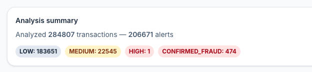
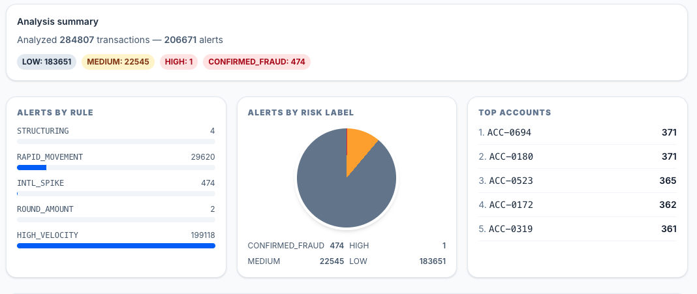
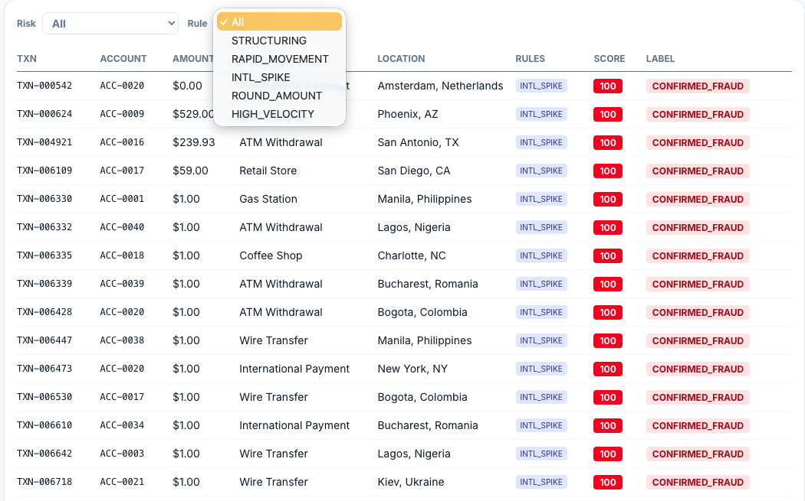

# log24x — Fraud Transaction Intelligence Suite

I built this because most fraud monitoring systems just flag a transaction and slap a score on it. They don't tell you *why* it looks suspicious. Analysts end up manually digging through raw data hundreds of times a day to figure out what's actually going on.

log24x fixes that. It runs 5 rule-based fraud detection checks against transaction data and then uses Google Gemini to generate plain English investigation briefings for each flagged alert — written like a senior fraud analyst would write them. Upload a CSV, get an alert queue sorted by risk, click any alert and read an AI-generated summary of what looks off and what to investigate next.

## What It Does

1. **Enriches raw transaction data** — takes the Kaggle credit card fraud dataset and adds account IDs, merchant names, locations, and timestamps so it looks like real bank data
2. **Runs 5 fraud detection rules** — each one maps to a real fraud typology that actual fraud teams monitor for
3. **Scores and labels every alert** — based on how many rules fired on the same transaction
4. **Generates AI investigation notes** — Gemini writes 3-5 sentence briefings from the perspective of a senior analyst, cached in Redis so repeat views are instant
5. **Displays everything in a dashboard** — alert queue, risk charts, filter by rule or risk level, click-to-explain

## Fraud Detection Rules

Each rule targets a specific fraud pattern. These aren't made up — they reflect what real transaction monitoring systems flag.

### STRUCTURING — Threshold Avoidance
Banks have to report transactions over $10,000 to FinCEN. Criminals know this and split large amounts into chunks just under the limit. This rule flags accounts with 3+ transactions between $8,000 and $9,900 within any 24-hour window. Structuring is a federal crime on its own, regardless of where the money came from.

### RAPID_MOVEMENT — Money Mule Detection
Money mules receive stolen funds into their account, keep a small cut, and send the rest somewhere else. The pattern is simple: big credits in, almost-equal debits out, fast. This rule flags accounts where outbound debits consume more than 85% of inbound credits within 48 hours, but only when credits exceed $5,000 to filter out normal small-account activity.

### INTL_SPIKE — Geographic Anomaly
If an account has been mostly domestic for its entire history and suddenly starts transacting in Lagos, Kiev, and Bucharest in the same week — that's a red flag. This rule flags accounts where international transactions jump above 30% of total activity, with minimum thresholds (5+ total transactions, 2+ international) to avoid false positives on new accounts.

### ROUND_AMOUNT — Wire Fraud Indicator
Legitimate purchases are rarely exactly $10,000.00 or $15,000.00. But manually typed wire transfers often are. This rule flags any transaction at $5,000 or above that lands on an exact thousand-dollar amount. Simple check, but it catches a surprising number of manually staged fraud transfers in practice.

### HIGH_VELOCITY — Bot and Burst Activity
Normal people don't make 8+ transactions in a single hour. Card testing attacks, automated fraud scripts, and compromised point-of-sale terminals can. This rule flags accounts that exceed 8 transactions in any rolling 1-hour window.

## Risk Scoring

When the rules run, a single transaction can trigger multiple rules at once. More rules firing = higher confidence something is wrong.

| Rules Fired | Score | Label |
|---|---|---|
| 1 rule | 30 | `LOW` |
| 2 rules | 60 | `MEDIUM` |
| 3+ rules | 90 | `HIGH` |
| Known fraud (ground truth) | 100 | `CONFIRMED_FRAUD` |

The `CONFIRMED_FRAUD` label comes from the original Kaggle dataset's fraud labels — these are transactions that were actually confirmed as fraudulent. This lets you measure how well the rules perform against known outcomes.

## AI-Generated Investigation Briefings

When you click an alert in the dashboard, the system sends the full transaction context to Google Gemini — amount, merchant, location, timestamp, which rules fired, and the risk score — and asks it to write a short investigation note.

The prompt tells Gemini to write like a senior fraud analyst briefing a junior analyst. Not a formal report, not bullet points. Direct, specific, actionable. Something like:

> *"The three wire transfers to international payment services totaling $27,400 within 18 hours, all from an account with no prior international activity, strongly suggest a structuring pattern combined with geographic anomaly. I'd pull the full 90-day history on this account and check if the beneficiary accounts have any existing SARs filed against them."*

Explanations are cached so you're not making an API call every time someone reopens the same alert.

## The Dataset

Built on the [Kaggle Credit Card Fraud Detection](https://www.kaggle.com/datasets/mlg-ulb/creditcardfraud) dataset — 284,807 real credit card transactions with 492 confirmed fraud cases. The raw features (V1–V28) are PCA-anonymized for privacy.

I wrote an enrichment layer that adds realistic metadata (accounts, merchants, locations) on top of the original data while preserving the real fraud labels. The enrichment is designed so the fraud patterns are actually detectable by the rules — fraud transactions cluster on a small set of accounts, lean toward suspicious merchant types, and show international locations at higher rates. This mirrors how fraud actually distributes in real transaction data.

---

📂 **[Setup & Running Instructions](docs/SETUP.md)** — how to get everything running locally

🔧 **[Architecture & Technical Details](docs/ARCHITECTURE.md)** — API endpoints, code structure, detection engine design, caching strategy, dashboard components
